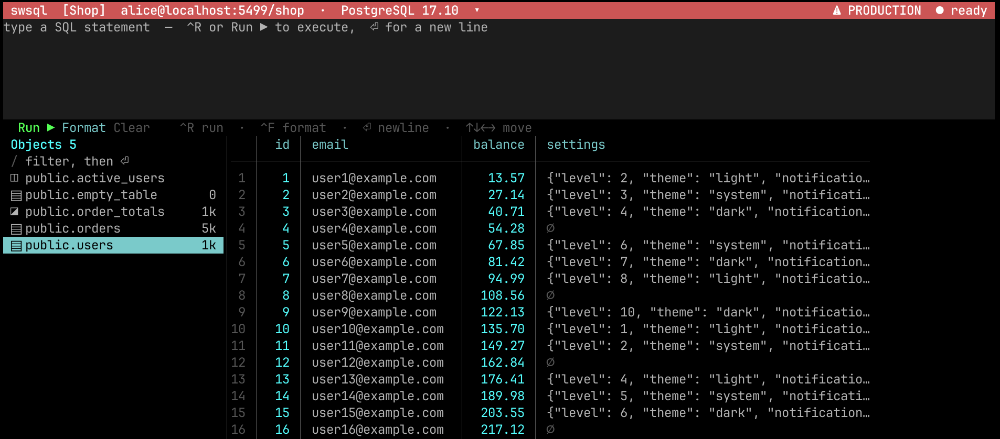

# swsql

A PostgreSQL client for the terminal, written in Swift with
[SwiftTUI](https://github.com/rensbreur/SwiftTUI).



```
 swsql  alice@db.internal:5432/shop  ·  PostgreSQL 16.10                    ● ready
 sql> select id, email, balance, settings from users order by id limit 60
 select id, email, balance, settings from users order by id limit 60
 Objects 5                    │   │  id │ email              │ balance │ settings
 / filter, then ⏎             │───┼─────┼────────────────────┼─────────┼──────────────────────
 ◫ public.active_users        │ 1 │   1 │ user1@example.com  │   13.57 │ {"level": 1, "theme"…
 ▤ public.empty_table       0 │ 2 │   2 │ user2@example.com  │   27.14 │ {"level": 2, "theme"…
 ◪ public.order_totals     1k │ 3 │   3 │ user3@example.com  │   40.71 │ {"level": 3, "theme"…
 ▤ public.orders           5k │ 4 │   4 │ user4@example.com  │   54.28 │ ∅
 ▤ public.users            1k │ 5 │   5 │ user5@example.com  │   67.85 │ {"level": 5, "theme"…
                              │  ⇟ ⇞ ◀ ▶ Struct Hist ?  rows 1-28/60  cols 1/4
 60 rows, 4 columns in 2.1 ms
 ↑↓←→ move   ⏎ run / inspect row   ^C quit
```

## What it does

- **Browse** every table, view, materialised view and foreign table in the
  database, with row estimates and a filter.
- **Write** SQL in a multi-line editor with autocomplete for keywords, tables and
  columns, and **format** it with one keystroke.
- **Run** any statement and read the result in an aligned grid, with NULL shown
  as `∅` so it can never be confused with the string `"NULL"`, numbers flushed
  right, and embedded newlines and tabs made visible instead of tearing the
  table apart.
- **Inspect** a single row vertically, which is the only readable way to look at
  a wide record.
- **Copy** any cell: click it to highlight it, then `^Y` (or a `⌘C` remap) puts
  the full underlying value on the system clipboard - the whole JSON blob, not
  the truncated text on screen.
- **See structure**: column types, primary keys, nullability and defaults.
- **Cancel** a statement that is taking too long. The interface stays responsive
  while a query runs, and the cancel request goes to the server the same way
  `psql`'s does.
- **Re-run** anything from the statement history.
- **Understand failures**: the error pane shows the server's severity, SQLSTATE,
  message, detail, hint and the character position in the statement.

## Building

swsql links against **libpq**, PostgreSQL's own client library. That is a
deliberate choice: libpq returns every value in text format, so swsql renders
extension types, domains, user-defined enums and composites exactly as the
server formats them, rather than guessing at binary encodings for types it has
never heard of. It also means connection handling - `PGHOST` and friends,
`~/.pgpass`, service files, SSL modes, Kerberos - is the same as `psql`'s,
because it *is* `psql`'s.

```sh
brew install libpq          # macOS
apt install libpq-dev       # Debian / Ubuntu

make release
make install                # installs to /usr/local/bin, override with PREFIX=
```

`make` finds Homebrew's keg-only libpq for you. If you prefer to drive SwiftPM
directly, point it at the directory holding `libpq.pc`:

```sh
export PKG_CONFIG_PATH="$(brew --prefix libpq)/lib/pkgconfig"
swift build -c release
```

Requires Swift 6.0 or later and macOS 13 or later.

## Connecting

```sh
swsql                                 # PG* environment variables and defaults
swsql shop                            # a database by name
swsql postgres://alice@db/shop        # a URI
swsql "host=db user=alice"            # a libpq keyword string
swsql -h db.internal -U alice -d shop # discrete options
```

Anything not given on the command line is resolved by libpq exactly as `psql`
resolves it. Connections are tagged `application_name=swsql`, so they are easy
to pick out in `pg_stat_activity`.

### The setup screen

Run `swsql` with no arguments and nothing saved yet, and it opens on a setup
screen that asks for a connection. Give it an optional **name** (`prod`,
`staging`), the connection details, and, if it is production, flip the
**production** toggle. Only a connection that actually connected is saved.

The **② Connection** step takes the details either way you prefer:

- **URL** - a `postgres://` URI, a libpq keyword string, or a bare database
  name. Press `⏎` in the box to connect. Pressing `⏎` on an empty URL falls back
  to libpq's environment defaults without saving anything.
- **fields** - the individual pieces (host, port, user, password, database) for
  when you would rather not assemble a connection string. Fill in what you know,
  leave the rest blank to take libpq's defaults, then press **connect ▶**. The
  password is masked once entered and never shown in full afterwards.

### Multiple connections

swsql remembers every connection you add, so you can keep `staging` and `prod`
side by side and switch between them:

- Click the connection shown in the title bar (marked with a `▾`), or press the
  `Conn` button, to open the connection list. Pick one to connect to it, or
  choose `＋ Add a connection` to add another.
- `swsql` with no arguments reconnects to the one you used last; `swsql <name>`
  opens a saved connection by name.
- The list is stored as JSON at `~/.config/swsql/connections.json` (honouring
  `XDG_CONFIG_HOME`). An entry can embed a password, so the file is written
  `0600`, the same posture `psql` requires of `~/.pgpass`. An older single
  `connection` file is migrated automatically on first run.
- A connection named on the command line as a URL (rather than a saved name) is
  used as-is and is never saved.

### Production connections

A connection tagged as production is impossible to mistake for anything else:
whenever you are connected to it, the title bar turns red and reads
`⚠ PRODUCTION`, and it is flagged in the connection list. (The tag is passive -
it warns, it does not block; a confirmation step before connecting or writing is
a natural next addition.)

## Keys

The interface is driven by moving focus and activating what is focused, either
from the keyboard or with the mouse.

| Key | Does |
| --- | --- |
| `↑ ↓ ← →` | move between the prompt, the sidebar, result rows and the buttons |
| `⏎` | run the statement in the prompt, open a table, inspect a row, press a button |
| `⌫` | delete the character before the cursor |
| `^Y` | copy the highlighted cell to the system clipboard (remap `⌘C` to send it, see below) |
| `Esc` | go back to the result grid from any other pane (or close the autocomplete menu, or clear the highlighted cell) |
| `^C` / `^D` | quit |

The buttons under the results do the rest: `⇟` `⇞` page through a large result,
`◀` `▶` scroll one column at a time, `Struct` shows the selected table's
columns, `Hist` lists earlier statements, `Conn` switches between saved
connections, `?` opens help, and `Rows` returns to the grid from any other pane.

The object filter is a single-line field: type, then press `⏎`. It edits like
any other text field - see the movement and deletion keys below, which work in
every field in the app.

## Editing SQL

The SQL input is a multi-line editor.

| Key | Does |
| --- | --- |
| `↑ ↓ ← →` | move the cursor (and step out to the sidebar / buttons at the edges) |
| `⌥ ←` / `⌥ →` &nbsp;(or `^← / ^→`) | move by word |
| `⌘ ←` / `⌘ →`, `Home` / `End` | jump to line start / end (`^A` / `^E` too) |
| `⌘ ↑` / `⌘ ↓` | jump to the start / end of the whole query |
| `⏎` | insert a new line |
| `⌫` | delete a character; `⌥ ⌫` deletes the previous word |
| `⌘ ⌫` | delete to the start of the line (`^U` too) |
| `fn ⌫` | forward-delete the character under the cursor |
| `^R` | run the query (from anywhere) |

- **`^R`**, or the **`Run ▶`** button, executes the whole editor.
- **`Format`** pretty-prints the query in place: keywords are upper-cased, each
  clause starts a new line, list items are indented, and subqueries are nested -
  while string literals and comments are left exactly as written.
- **`Clear`** empties the editor.
- **Autocomplete:** as you type an identifier, a dropdown of matching SQL
  keywords, tables/views and columns (from the connected database) appears under
  the editor. `↑ ↓` pick, `⏎` or `Tab` insert, `Esc` closes. Suggestions are
  context-aware - tables rank first after `FROM`/`JOIN`, columns after a
  `qualifier.`.
- Choosing a statement from `Hist` loads it back into the editor to edit or run
  again.

Every single-line text field - the setup form's name, URL and per-field inputs,
and the sidebar's object filter - edits the same way: the cursor moves with
`← →`, jumps by word with `⌥` and to the ends with `⌘`/`Home`/`End`, all the
deletes above work, and a click puts the cursor where you point.

### Terminal setup for `⌘` and `⌥` keys

swsql understands the standard escape sequences terminals send for these keys, so
it works in any terminal that can send them - but two things depend on your
terminal, not on swsql:

- **`⌘` (Command) is never delivered to a terminal program** - macOS keeps it for
  menu shortcuts. To use `⌘R`, `⌘←/→`, `⌘↑/↓`, remap them in your terminal to send
  the sequences swsql reads. Apple's **Terminal.app cannot** remap `⌘`; use the
  `^`/`⌥` keys there instead. iTerm2, WezTerm, Kitty and Ghostty can.
- **`⌥` (Option)** must be sent as Meta for `⌥←/→` and `⌥⌫` to work (in
  Terminal.app: *Profiles → Keyboard → Use Option as Meta key*).

Example for **WezTerm + tmux** (`~/.wezterm.lua`):

```lua
local wezterm = require('wezterm')
local act = wezterm.action
return {
  keys = {
    -- ⌘C: copy the terminal selection when there is one (then clear it, so a
    -- stale selection never shadows the other branch), otherwise send ^Y so
    -- swsql copies its highlighted cell. Copying stays intact everywhere else.
    { key = 'c', mods = 'CMD', action = wezterm.action_callback(function(window, pane)
        if window:get_selection_text_for_pane(pane) ~= '' then
          window:perform_action(act.Multiple {
            act.CopyTo('ClipboardAndPrimarySelection'),
            act.ClearSelection,
          }, pane)
        else
          window:perform_action(act.SendString('\x19'), pane)
        end
      end) },
    { key = 'r',          mods = 'CMD', action = act.SendString('\x12')     }, -- ⌘R  → run
    { key = 'LeftArrow',  mods = 'CMD', action = act.SendString('\x1b[H')   }, -- ⌘←  → line start
    { key = 'RightArrow', mods = 'CMD', action = act.SendString('\x1b[F')   }, -- ⌘→  → line end
    { key = 'UpArrow',    mods = 'CMD', action = act.SendString('\x1b[1;5H')}, -- ⌘↑  → query start
    { key = 'DownArrow',  mods = 'CMD', action = act.SendString('\x1b[1;5F')}, -- ⌘↓  → query end
    { key = 'LeftArrow',  mods = 'OPT', action = act.SendString('\x1b[1;3D')}, -- ⌥←  → word left
    { key = 'RightArrow', mods = 'OPT', action = act.SendString('\x1b[1;3C')}, -- ⌥→  → word right
    { key = 'Backspace',  mods = 'OPT', action = act.SendString('\x1b\x7f') }, -- ⌥⌫  → delete word
    { key = 'Backspace',  mods = 'CMD', action = act.SendString('\x15')     }, -- ⌘⌫  → delete to line start
  },
}
```

In `~/.tmux.conf`, let modified keys through (and keep the prefix off `^R`):

```tmux
set -g xterm-keys on
set -s extended-keys on
```

## Mouse

Click a table, a row's number or any button to focus and activate it; click a
text field to type into it. The scroll wheel moves the focus up and down, which
is how you scroll the sidebar or the result grid. Scrolling sideways with the
pointer over the grid moves through the columns, the same step the `◀` `▶`
buttons take.

In the result grid every value is its own click target: click (or double-click)
a cell to highlight it, then `^Y` - or `⌘C` with the remap above - copies its
full value to the system clipboard, untruncated, exactly as the server sent it.
`Esc` clears the highlight. Clicking the row number at the left edge still
opens the row inspector, as does `⏎` on a focused row.

Copying goes through `pbcopy` / `wl-copy` / `xclip` when one is available, and
falls back to the OSC 52 escape sequence, which reaches your local clipboard
even over SSH in terminals that support it.

Mouse reporting is on whenever swsql is running, so selecting text to copy it
works the way it does in any terminal program that tracks the mouse: hold `⌥` or
`⇧` while dragging. This is why swsql links a small
[fork of SwiftTUI](https://github.com/vdsingh/SwiftTUI) -
the upstream library is keyboard-only, and the fork adds the SGR mouse handling.

## Limits and shape

- Results are capped at 10,000 rows, and table previews fetch 500. A client
  should not fall over because someone selected a billion rows.
- The grid builds one screenful of rows at a time. Paging is explicit so that the
  buttons under the grid are always one keypress below the last visible row.
- Column widths are measured once per result from the first 200 rows and capped
  at 44 characters, so a single JSON blob cannot push every other column off the
  screen.
- The SQL editor has completion but no syntax highlighting, and the formatter
  aims at readable everyday SQL rather than covering every dialect corner.
- Character widths are counted per grapheme cluster, matching how SwiftTUI draws
  cells. Wide CJK glyphs and emoji will therefore sit a little loose in a column.

## Layout

```
Sources/
  CLibPQ/          system library target exposing libpq-fe.h
  SWSQLCore/       everything testable and terminal-independent
    LibPQ/         connection, results, errors, type names
    Layout/        column sizing, span rendering, screen regions
    Catalog.swift  introspection queries and their parsing
  swsql/           the SwiftTUI application: model and views
Tests/SWSQLCoreTests/
```

`SWSQLCore` has no dependency on SwiftTUI, and the layout code has no dependency
on a live connection, so the awkward cases - a column wider than the screen, a
zero-width viewport, a result set that changes shape under a resize - are all
covered by ordinary unit tests.

## Notes on SwiftTUI

Two behaviours of the library shape the code and are worth knowing if you extend
it:

- `Button.updateNode` never refreshes the control's action closure, so a button's
  action is frozen at the moment it is first built. Every action here therefore
  takes an index or no argument at all and resolves what it acts on from the
  model at press time.
- Arrow keys are consumed by focus navigation and never reach a control, so
  anything that would be a shortcut elsewhere is a button here.
